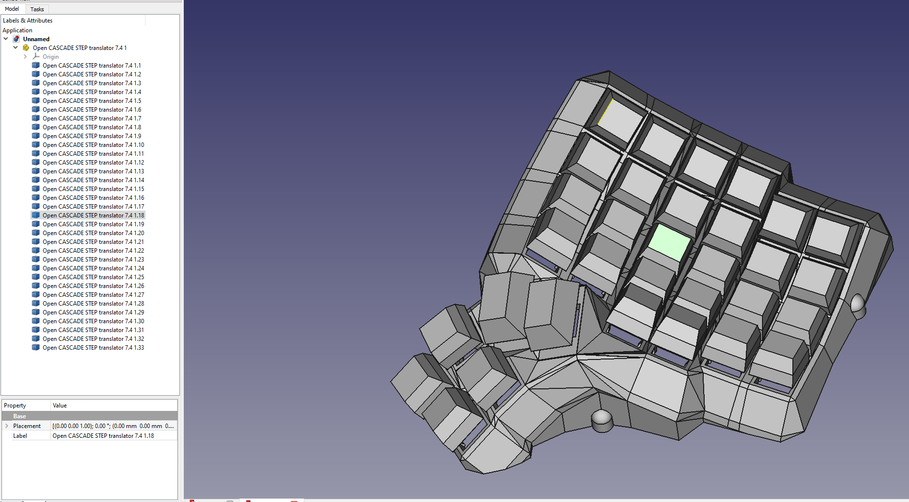

# The Dactyl-ManuForm Keyboard - Python 3 - Cadquery
This is a fork of [Dactyl-Manuform](https://github.com/tshort/dactyl-keyboard) by Tom Short, which itself is a fork of [Dactyl](https://github.com/adereth/dactyl-keyboard) by Matthew Adereth, a parameterized, split-hand, concave, columnar, ergonomic keyboard.

While the code structure remains comparable to the original, Clojure and OpenSCAD have been replaced by Python and cadquery/OpenCASCADE.  The predecessors were exceptional contributions to the ergo keyboard community by the authors but used a rather esoteric programming language, Clojure, and a relatively inconsistent geometry engine, OpenSCAD.  My hope is that by converting the code the community will have an easier time modifying and evolving this design.  

## Updated Geometry Engine, now generating STEP files !!!
As part of the effort to create a new engine I converted the code to cadquery/OpenCASCADE.  While OpenSCAD has provided an open source 3D engine that is extremely popular, it frankly creates barely passable STLs when you have complex geometry.  After being extremely frustrated trying to fix the mesh I realized it is just not a stable engine to create high quality files.  OpenCASCADE is extremely powerful but requires extensive detail to operate.  cadquery provided an excellent platform to run a stable geometry engine with a simplified API. 

## Added Feature
Added a new switch for hot swap and a way to include any additional geometry in the key plate by use of an imported file.  For hot swap just change the line to `hot_swap = True`.  To import an arbitrary geometry set the `plate_file = None` and `plate_offset = 0.0`.  The file must be .step for OpenCascade / cadquery and .stl for openSCAD / solid python.  The zero reference should be the key center (XY), and the top of the plate (Z).  Plate offset is a Z-axis translation for minor adjustments without modifying the geometry file.  If you don't want the "nubs" you have to modify the plate function.  It will propagate to all key plate usage.  

**DISCLAIMER:  I have not built the hot swap version and cannot speak to the geometry.  I found it running around in various places and don't know the origin.**  

If you know the origin I would like to credit the originator.  If you test it I'd love to know how well it works or if you come up with a better geometry I'm happy to add it.  

Message me on Reddit u/j_oshreve if you are really stuck.  I don't have much time to help, but can answer the occasional question.  Also feel free to put in a pull request if you come up with something crafty and want to give others access to it.

## Status / Future
FWIW, the cadquery version is essentially a double translation and is now a bit of a mess.  I wanted to share with the community as the first version of dactyl-manuform that exports as a STEP file, allowing easier editing.  I am happy to maintain the code, but I am unlikely to spend much more time cleaning it up as I am working on an entirely new object-oriented generator in Python/cadquery.  This was my proof of concept for eliminating OpenSCAD from the workflow and I thought it worth giving back to the community. 

**The majority of the the rest of the below content is as defined by previous authors, except where noted.**

The main change is that the thumb cluster was adapted from the [ManuForm keyboard](https://github.com/jeffgran/ManuForm) ([geekhack](https://geekhack.org/index.php?topic=46015.0)). The walls were changed to just drop to the floor. The keyboard is paramaterized to allow adjusting the following: 

* Rows: 4 - 6 
* Columns: 5 and up
* Row curvature
* Column curvature
* Row tilt (tenting)
* Column tilt
* Column offsets
* Height

I built a 4x5 version (40% size) for myself. The default has a bit more tenting than the Dactyl. See the following model files for configurations that may be most common:

* [40% size, (4x5)](https://github.com/tshort/dactyl-keyboard/blob/master/things/right-4x5.stl)
* [60% size, (5x6)](https://github.com/tshort/dactyl-keyboard/blob/master/things/right-5x6.stl)

## Assembly

### Generating a Design - Modified for Python Implementation

**Setting up the Python environment - NEW**
* [Install Python 3.X](https://www.python.org/downloads/release/python-385/) or use your [favorite distro / platform (Anaconda)](https://www.anaconda.com/products/individual) 
* It is advisable, but not necessary, to setup a virtual environment to prevent package/library incompatibility 
* [Install Numpy](https://pypi.org/project/numpy/), easiest method is `pip install numpy` or `pip3 install numpy` on linux.

**cadquery install**
* [Install scipy](https://pypi.org/project/scipy/), easiest method is `pip install scipy` or `pip3 install scipy` on linux.
* [Install cadquery](https://github.com/CadQuery/cadquery), many options (see link), but easiest method is `conda install -c conda-forge -c cadquery cadquery=2`.  Props to the creators/maintainers, this has the power of Open CASCADE with nearing the simplicity of OpenSCAD.

**OpenSCAD install**
* [Install SolidPython](https://pypi.org/project/solidpython/), easiest method is `pip install solidpython` or `pip3 install solidpython` on linux.
* [Install OpenSCAD](http://www.openscad.org/)

**Generating the cadquery design - NEW**
* Run `python dactyl_manuform_cadquery.py` or `python3 dactyl_manuform_cadquery.py` 
* This will regenerate the `things/*.step` files
    * `left_og_py.step`
    * `right_og_py.step`
    * `plate_og_py.step`
* Use FreeCAD or other program to open a `.step` file.
* Export functions can be modified to export stl directly if desired.
 When done, use FreeCAD or other CAD program to modify, edit, or export to STL.

**Generating the OpenSCAD design - NEW**
* Run `python dactyl_manuform.py` or `python3 dactyl_manuform.py` 
* This will regenerate the `things/*.scad` files
    * `left_py.scad`
    * `right_py.scad`
    * `plate_py.scad`
* Use OpenSCAD to open a `.scad` file.
* Make changes to design, repeat run step, OpenSCAD will watch for changes and re-render.
* When done, use OpenSCAD to export STL files

### Printing
Pre-generated STL files are available in the [things/](things/) directory. 
When a model is generated, it also generates a `.scad` model for a bottom plate. 
This can be exported to a DXF file in OpenSCAD.
The [things/](things/) directory also has DXF files for the bottom plate.
When laser cut, some of the inside cuts will need to be removed. 

### Thingiverse

[The 4x5 STL left/right pair](https://www.thingiverse.com/thing:2349390) from the [things/](things/) directory is in the thingiverse for public printing

### Wiring

Here are materials tshort used for wiring.

* Two Arduino Pro Micros
* [Heat-set inserts](https://www.mcmaster.com/#94180a331/=16yfrx1)
* [M3 wafer-head screws, 5mm](http://www.metricscrews.us/index.php?main_page=product_info&cPath=155_185&products_id=455)
* [Copper tape](https://www.amazon.com/gp/product/B009KB86BU)
* [#32 magnet wire](https://www.amazon.com/gp/product/B00LV909HI)
* [#30 wire](https://www.amazon.com/gp/product/B00GWFECWO)
* [3-mm cast acrylic](http://www.mcmaster.com/#acrylic/=144mfom)
* [Veroboard stripboard](https://www.amazon.com/gp/product/B008CPVMMU)
* [1N4148 diodes](https://www.amazon.com/gp/product/B00LQPY0Y0)
* [Female RJ-9 connectors](https://www.amazon.com/gp/product/B01HU7BVDU/)

I wired one half using the traditional approach of using the legs of a diode to form the row connections. 
(I'm not great at soldering, so this was challenging for me.)
For this side, I used magnet wire to wire columns. That worked okay. 
The magnet wire is small enough, it wants to move around, and it's hard to tell if you have a good connection.

For another half, I used stripboard for the row connections. 
This allowed me to presolder all of the diodes. 
Then, I hot-glued this in place and finished the soldering of the other diode ends. 
I like this approach quite a lot. 
Connections for the diodes were much easier with one end fixed down. 
On this half, I also used copper tape to connect columns. 
This worked a bit better than the magnet wire for me. 
For a future version, I may try just bare tinned copper wire for columns (something like #20). 
With the stripboard, it's pretty easy keeping row and column connections separate.

Note that a telephone handset cable has leads that are reversed, so take this into account when connecting these leads to the controller.

The 3D printed part is the main keyboard. 
You can attach a bottom plate with screws. 
The case has holes for heat-set inserts designed to hold 3- to 6-mm long M3 screws. 
Then, I used wafer-head screws to connect a bottom plate. 
If wires aren't dangling, a bottom plate may not be needed. 
You need something on the bottom to keep the keyboard from sliding around. 
Without a plate, you could use a rubber pad, or you could dip the bottom of the keyboard in PlastiDip.

For more photos of the first complete wiring of v0.4, see [Imgur](http://imgur.com/a/v9eIO).

This is how the rows/columns wire to the keys and the ProMicro

#### Alternative row-driven wiring diagram for ProMicro:

NOTE: you also make sure the firmware is set up correctly (ex: change row pins with col pins)

### Firmware

Firmware goes hand in hand with how you wire the circuit. 
I adapted the QMK firmware [here](https://github.com/tshort/qmk_firmware/tree/master/keyboards/dactyl-manuform). 
This allows each side to work separately or together. 
This site also shows connections for the Arduino Pro Micro controllers.

## License

Copyright © 2015-2020 Matthew Adereth, Tom Short, and Joshua Shreve

The source code for generating the models (everything excluding the [things/](things/) and [resources/](resources/) directories is distributed under the [GNU AFFERO GENERAL PUBLIC LICENSE Version 3](LICENSE).  The generated models and PCB designs are distributed under the [Creative Commons Attribution-NonCommercial-ShareAlike License Version 3.0](LICENSE-models).
