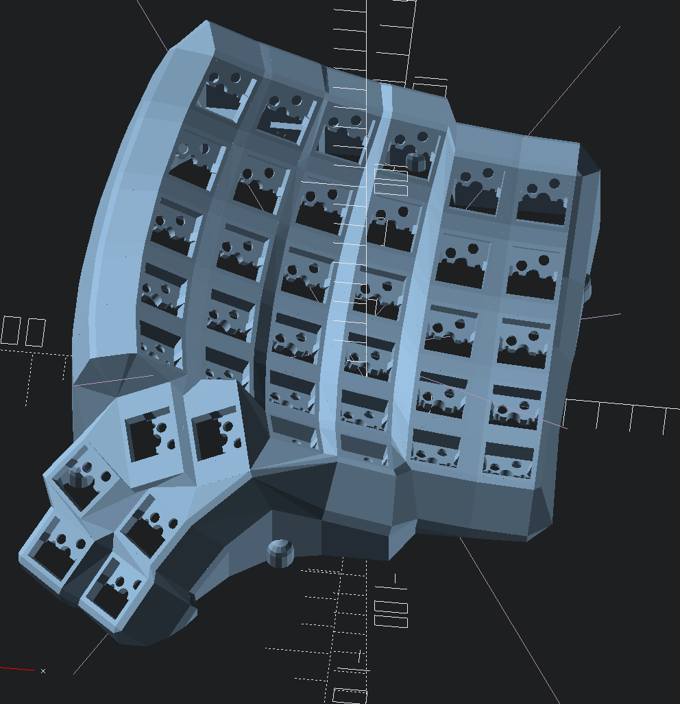
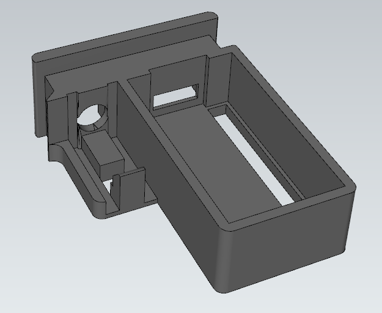
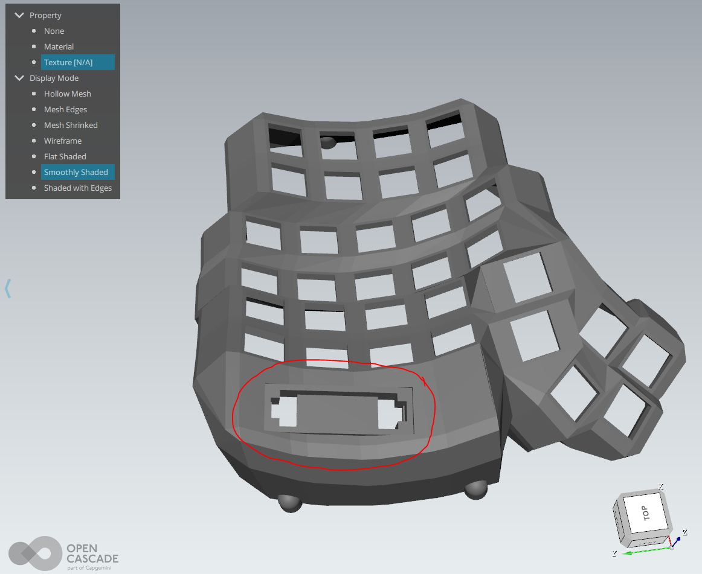

# The Dactyl-ManuForm Keyboard - Python 3 - Cadquery
This is a fork of [Dactyl-Manuform](https://github.com/tshort/dactyl-keyboard) by Tom Short, which itself is a fork of [Dactyl](https://github.com/adereth/dactyl-keyboard) by Matthew Adereth, a parameterized, split-hand, concave, columnar, ergonomic keyboard.

While the code structure remains comparable to the original, Clojure and OpenSCAD have been replaced by Python and cadquery/OpenCASCADE.  The predecessors were exceptional contributions to the ergo keyboard community by the authors but used a rather esoteric programming language, Clojure, and a relatively inconsistent geometry engine, OpenSCAD.  My hope is that by converting the code the community will have an easier time modifying and evolving this design.  

## Helpful Feedback
**Special thanks to [u/loss_of_signal](https://www.reddit.com/user/loss_of_signal/) on Reddit** for exceptionally useful feedback and suggestions.  Our discussions led to the addition of the controller tray and prompted me to finally add a real OLED mount.  **As someone trying to give the community something new and useful, productive feedback is both extremely helpful and extremely rare.**  Never be afraid to send a message or make a pull request.  I may or may not decide to implement the suggestion, but the discussion and consideration is always worthwhile. 

## Updated Geometry Engine, now generating STEP files !!!
As part of the effort to create a new engine I converted the code to cadquery/OpenCASCADE.  While OpenSCAD has provided an open source 3D engine that is extremely popular, it frankly creates barely passable STLs when you have complex geometry.  After being extremely frustrated trying to fix the mesh I realized it is just not a stable engine to create high quality files.  OpenCASCADE is extremely powerful but requires extensive detail to operate.  cadquery provided an excellent platform to run a stable geometry engine with a simplified API. 

## Added Features

### Docker Autobuild

At the excellent suggestion of [martint17r](https://github.com/joshreve/dactyl-keyboard/issues?q=is%3Apr+author%3Amartint17r) 
I have added docker configurations with an Windows batch file to assist with getting setup. 
If there is sufficient interest I can add a .sh file as well.  If you have 
[docker desktop](https://www.docker.com/products/docker-desktop) installed, the batch file will create the 
dactyl-keyboard image and 3 containers:  DM-run: runs the dactyl_manuform.py, DM-config: runs generate_configuration.py,
and DM-shell:  just starts an interactive session to manually run from shell (tip: run bash after entering to get the better 
shell environment).  All apps bindmount the src and things directory to allow editing in the host and running in the
container.  While not exactly hard drive space efficient, this hopefully this helps those having issue getting
cadquery running and prevents local Python conflicts.  It works well on my computer, but I don't use
docker often, so please let me know if you find any issues with the approach.

### Refactored

Your settings are now created by `generate_configuration.py` or by direct modification fo the `run_config.json` file.  
This allows you to save `run_config.json` to share your configuration.

Additionally, the OpenSCAD/solid python and OpenCASCADE/cadquery versions are merged with separate helper functions 
to decouple the generator from the target library.  This also lets me stay sane by only modifying one file for most updates.
Running `dactyl_manuform.py` will automatically load the `run_config.json` file. 

### Everyone gets a thumb cluster!

Added support of for the thumb clusters in the [carbonfet Dactyl library](https://github.com/carbonfet/dactyl-manuform).
These are the "mini" and "carbonfet" thumb clusters. Feel free to try them out with by setting `'thumb_style'` to 
`'DEFAULT'`, `'MINI'`, or `'CARBONFET'`.

Rendered and actual images to be added in future commits.

### Clippable switch mounting

Tired of hot glue and constraining the socket with "nubs"?  I've added an adjustable undercut for using the clips on 
the sockets.  May require some tweaking and little filing, but I have my DM built without any glue and you can too.  
Just use `plate_style = 'UNDERCUT'`.  I've also added an improved local undercut using `plate_style = 'NOTCH'`.

### Kailh Hotswap
Added a new switch for hot swap and a way to include any additional geometry in the key plate by use of an imported file.
For hot swap just use `plate_style = 'HS_NOTCH'`, `plate_style = 'HS_HOLE'`, or `plate_style = 'HS_NUB'`.  
To import an arbitrary geometry set the `plate_file = None` and `plate_offset = 0.0`.  
The file must be .step for OpenCascade / cadquery and .stl for openSCAD / solid python.  
The zero reference should be the key center (XY), and the top of the plate (Z).  
Plate offset is a Z-axis translation for minor adjustments without modifying the geometry file.  

**DISCLAIMER:  I have not built the hot swap version and cannot speak to the geometry.  I found it running around in various places and don't know the origin.  At least one user has claimed it works.**  

If you know the origin I would like to credit the originator.  If you test it I'd love to know how well it works or if you come up with a better geometry I'm happy to add it.  

Message me on Reddit u/j_oshreve if you are really stuck.  I don't have much time to help, but can answer the occasional question.  Also feel free to put in a pull request if you come up with something crafty and want to give others access to it.

### Multiple Controller Mounts

Added an external mount for a separate controller tray.  Looks to work with lolligag's controller trays / holders:

- [Promicro V1](https://dactyl.siskam.link/loligagger-external-holder-promicro-v1.stl)
- [Promicro V2](https://dactyl.siskam.link/loligagger-external-holder-promicro-v2.stl)
- [Elite-C V1 ](https://dactyl.siskam.link/loligagger-external-holder-elite-c-v1.stl)

Just use `controller_mount_type = 'EXTERNAL'`.

This is a new feature so any feedback is appreciated.  If you have issues, message me on Reddit and I will try to help correct them.

### OLED Display Mount

Added 3 OLED mounts.  Have printed them stand alone with success.

`oled_mount_type = 'CLIP'` creates an opening to set the OLED with a clip on face plate to hold it down.  This is the preferred mounting, but needs the OLED to have a removable connection.  

`oled_mount_type = 'SLIDING'` creates an opening such that you can slide the screen up through the back and into place.  Needs a piece of foam or a bit of glue to lock in place.

`oled_mount_type = 'UNDERCUT'` creates an opening with an undercut to create whatever custom holder you want.  Will not work without additional part creation from the user.

This is a new feature so any feedback is appreciated.  If you have issues, message me on Reddit and I will try to help correct them.  

### Screw Post Locations

You can now have slightly better control of screw mounts.  Set to `'screws_offset':'INSIDE'`, `'screws_offset':'OUTSIDE'` or `'screws_offset': 'ORIGINAL'` to control screw locations relative to the wall. 

## Status / Future
This is now a bit of a monster of many minds and yet continues to bear fruit.  I plan to continue to use this code to try new geometries and features to share.  I am still working on a new generator, but feel this one can continue to evolve and inform the other effort.

## Generating a Design

**Setting up the Python environment - NEW**
* [Install Python 3.X](https://www.python.org/downloads/release/python-385/) or use your [favorite distro / platform (Anaconda)](https://www.anaconda.com/products/individual) 
* It is advisable, but not necessary, to setup a virtual environment to prevent package/library incompatibility 
* [Install Numpy](https://pypi.org/project/numpy/), easiest method is `pip install numpy` or `pip3 install numpy` on linux.
* [Install dataclasses_json](https://pypi.org/project/dataclasses_json/), easiest method is `pip install numpy` or `pip3 install numpy` on linux.

**cadquery install**
* [Install scipy](https://pypi.org/project/scipy/), easiest method is `pip install scipy` or `pip3 install scipy` on linux.
* [Install cadquery](https://github.com/CadQuery/cadquery), many options (see link), but easiest method is `conda install -c conda-forge -c cadquery cadquery=2`.  Props to the creators/maintainers, this has the power of Open CASCADE with nearing the simplicity of OpenSCAD.

**OpenSCAD install**
* [Install SolidPython](https://pypi.org/project/solidpython/), easiest method is `pip install solidpython` or `pip3 install solidpython` on linux.
* [Install OpenSCAD](http://www.openscad.org/)

**Generating the design - UPDATED**
* ~~Run `python dactyl_manuform_cadquery.py` or `python3 dactyl_manuform_cadquery.py`~~ 
* ~~Run `python dactyl_manuform.py` or `python3 dactyl_manuform.py`~~
* Run `generate_configuration.py` or directly edit `run_config.json` to configure the design
* Run `dactyl_manuform.py` to create the geometry (ENGINE variable in run determines method)
* This will regenerate the `things/` files (or in subdirectory if defined in config)
    * `*left.*`
    * `*right.*`
    * `*plate.*`
    * `*oled_clip.*` (if applicable)
    * `*oled_clip_test.*` (if applicable)
* Use OpenSCAD to open a `.scad` file
* Use FreeCAD or other application to open a `.step` file
* Make changes to design, repeat run step
* When done, use OpenSCAD or FreeCAD to export STL files

**The majority of the the rest of the below content is as defined by previous authors, except where noted.**

## Origin

The main change is that the thumb cluster was adapted from the [ManuForm keyboard](https://github.com/jeffgran/ManuForm) ([geekhack](https://geekhack.org/index.php?topic=46015.0)). The walls were changed to just drop to the floor. The keyboard is paramaterized to allow adjusting the following: 

* Rows: 4 - 6 
* Columns: 5 and up
* Row curvature
* Column curvature
* Row tilt (tenting)
* Column tilt
* Column offsets
* Height

## Assembly

### Printing
Pre-generated files can be opened in OpenSCAD or FreeCAD and exported to STL.  Bottom plate is available as a step file or dxf for cadquery or a .scad file to be exported from OpenSCAD.

### Wiring

Here are materials tshort used for wiring.

* Two Arduino Pro Micros
* [Heat-set inserts](https://www.mcmaster.com/#94180a331/=16yfrx1)
* [M3 wafer-head screws, 5mm](http://www.metricscrews.us/index.php?main_page=product_info&cPath=155_185&products_id=455)
* [Copper tape](https://www.amazon.com/gp/product/B009KB86BU)
* [#32 magnet wire](https://www.amazon.com/gp/product/B00LV909HI)
* [#30 wire](https://www.amazon.com/gp/product/B00GWFECWO)
* [3-mm cast acrylic](http://www.mcmaster.com/#acrylic/=144mfom)
* [Veroboard stripboard](https://www.amazon.com/gp/product/B008CPVMMU)
* [1N4148 diodes](https://www.amazon.com/gp/product/B00LQPY0Y0)
* [Female RJ-9 connectors](https://www.amazon.com/gp/product/B01HU7BVDU/)

I wired one half using the traditional approach of using the legs of a diode to form the row connections. 
(I'm not great at soldering, so this was challenging for me.)
For this side, I used magnet wire to wire columns. That worked okay. 
The magnet wire is small enough, it wants to move around, and it's hard to tell if you have a good connection.

For another half, I used stripboard for the row connections. 
This allowed me to presolder all of the diodes. 
Then, I hot-glued this in place and finished the soldering of the other diode ends. 
I like this approach quite a lot. 
Connections for the diodes were much easier with one end fixed down. 
On this half, I also used copper tape to connect columns. 
This worked a bit better than the magnet wire for me. 
For a future version, I may try just bare tinned copper wire for columns (something like #20). 
With the stripboard, it's pretty easy keeping row and column connections separate.

Note that a telephone handset cable has leads that are reversed, so take this into account when connecting these leads to the controller.

The 3D printed part is the main keyboard. 
You can attach a bottom plate with screws. 
The case has holes for heat-set inserts designed to hold 3- to 6-mm long M3 screws. 
Then, I used wafer-head screws to connect a bottom plate. 
If wires aren't dangling, a bottom plate may not be needed. 
You need something on the bottom to keep the keyboard from sliding around. 
Without a plate, you could use a rubber pad, or you could dip the bottom of the keyboard in PlastiDip.

For more photos of the first complete wiring of v0.4, see [Imgur](http://imgur.com/a/v9eIO).

This is how the rows/columns wire to the keys and the ProMicro

#### Alternative row-driven wiring diagram for ProMicro:

NOTE: you also make sure the firmware is set up correctly (ex: change row pins with col pins)

### Firmware

Firmware goes hand in hand with how you wire the circuit. 
I adapted the QMK firmware [here](https://github.com/tshort/qmk_firmware/tree/master/keyboards/dactyl-manuform). 
This allows each side to work separately or together. 
This site also shows connections for the Arduino Pro Micro controllers.

## License

General Code Copyright © 2015-2021 Matthew Adereth, Tom Short, and Joshua Shreve
Mini thumb cluster Copyright © 2015-2018 Matthew Adereth, Tom Short, and Leo Lou
Carbonfet thumb cluster © 2015-2018 Matthew Adereth, Tom Short, and carbonfet (github username)

The source code for generating the models (everything excluding the [things/](things/) and [resources/](resources/) directories is distributed under the [GNU AFFERO GENERAL PUBLIC LICENSE Version 3](LICENSE).  The generated models and PCB designs are distributed under the [Creative Commons Attribution-NonCommercial-ShareAlike License Version 3.0](LICENSE-models).
